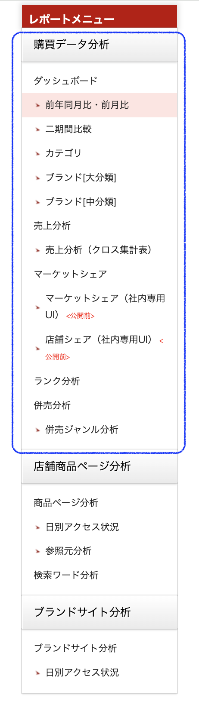

# 購買データ分析ダッシュボード — CM移行 Feasibility Report

> **対象:** RMP-For Brands「購買データ分析」セクション（下記スクリーンショット 青枠内）

---

## 対象ダッシュボード（スクリーンショット）

**青枠 = 本レポートの調査対象範囲（購買データ分析 全体）**

### 対象ダッシュボード一覧

| #   | ダッシュボード名         | CM 判定 | 判定区分      |
| --- | ---------------- | :---: | --------- |
| 1   | 前年同月比・前月比        |   ✅   | 対応可       |
| 2   | 二期間比較            |   ✅   | 対応可       |
| 3   | カテゴリ（流通実績）       |   ✅   | 対応可       |
| 4   | ブランド[大分類]        |   ✅   | 対応可       |
| 5   | ブランド[中分類]        |  ⚠️   | 対象外       |
| 6   | 売上分析             |   ✅   | 対応可       |
| 7   | 売上分析（クロス集計表）     |   ✅   | 対応可       |
| 8   | マーケットシェア（SOS）    |  ⚠️   | 対象外       |
| 9   | マーケットシェア（社内専用UI） |   ❓   | 対象外（社内専用） |
| 10  | 店舗シェア（社内専用UI）    |   ❓   | 対象外（社内専用） |
| 11  | ランク分析            |  ⚠️   | 対象外       |
| 12  | 併売分析             |  ⚠️   | 対象外       |
| 13  | 併売ジャンル分析         |  ⚠️   | 対象外       |

---

## サマリー

|        判定         | 件数  | ダッシュボード                                              | 詳細                                                                                                                                                                                                    |
| :---------------: | :-: | ---------------------------------------------------- | ----------------------------------------------------------------------------------------------------------------------------------------------------------------------------------------------------- |
|        対応可        |  6  | 売上分析 / クロス集計表 / 二期間比較 / 前年同月比・前月比 / カテゴリ / ブランド[大分類] | **売上分析系**：12軸 ❌（店舗グループ / **ブランド中分類** / **ブランド小分類** / 製品名 / 販売形態 / セット品 / よりどり品 / 新規リピート / リピートランク / マネタリーランク / OS / アプリ） **流通・比較系**：6軸 ❌（店舗グループ / **ブランド中分類** / **ブランド小分類** / 販売形態 / セット品 / よりどり品） |
| 部分対応 （近似・制約あり） |  2  | 併売分析 / 併売ジャンル分析                                      |                                                                                                                                                                                                       |
|       対応難易高       |  3  | ランク分析 / ブランド[中分類] / マーケットシェア                     |                                                                                                                                                                                                       |
|     対象外（社内専用）     |  2  | マーケットシェア（社内専用UI） / 店舗シェア（社内専用UI）                     |                                                                                                                                                                                                       |

---

## ダッシュボード別 対象外フィルター一覧

| ダッシュボード          | 対象外項目（CM非対応）                                                                                             |
| ---------------- | -------------------------------------------------------------------------------------------------------- |
| **前年同月比・前月比**    | 店舗グループ / ブランド中分類 / ブランド小分類 / 販売形態 / セット品 / よりどり品                                                         |
| **二期間比較**        | 店舗グループ / ブランド中分類 / ブランド小分類 / 販売形態 / セット品 / よりどり品                                                         |
| **カテゴリ（流通実績）**   | 店舗グループ / ブランド中分類 / ブランド小分類 / 販売形態 / セット品 / よりどり品                                                         |
| **ブランド[大分類]**    | 店舗グループ / ブランド中分類 / ブランド小分類 / 販売形態 / セット品 / よりどり品                                                         |
| **売上分析**         | 店舗グループ / ブランド中分類 / ブランド小分類 / **製品名** / 販売形態 / セット品 / よりどり品 / 新規リピート / リピートランク / マネタリーランク / 使用OS / アプリタイプ |
| **売上分析（クロス集計表）** | 店舗グループ / ブランド中分類 / ブランド小分類 / **製品名** / 販売形態 / セット品 / よりどり品 / 新規リピート / リピートランク / マネタリーランク / 使用OS / アプリタイプ |

### 対象外フィルターの分類

| 対象外フィルター     | 理由                                                          | 影響ダッシュボード数 |
| ------------ | ----------------------------------------------------------- | :--------: |
| **店舗グループ**   | `m_shop_group` はRMP専用マスタ。CM非対応（構造的）                         |    全6件     |
| **ブランド中分類**  | `sub_brand_name` が CM 全テーブルで NULL（DKDへデータ投入依頼中）             |    全6件     |
| **ブランド小分類**  | `sub_sub_brand_name` が CM 全テーブルで NULL（同上）                   |    全6件     |
| **製品名**      | `item_name`（楽天商品名）は `product_name`（nm208ブランド商品名）と粒度が異なり代替不可 | 売上分析・クロス集計 |
| **販売形態**     | RMP `selling_form_name`に該当するデータなし                           |    全6件     |
| **セット品**     | CM イベントマスタに `set_flg` なし                                    |    全6件     |
| **よりどり品**    | CM イベントマスタに `yoridori_flg` なし                               |    全6件     |
| **新規リピート**   | `ns215` pipeline が CM に存在しない（`brand_lapsed_days` 近似のみ）      | 売上分析・クロス集計 |
| **リピートランク**  | 同上                                                          | 売上分析・クロス集計 |
| **マネタリーランク** | 累積購買額の算出パイプラインがCMになし                                        | 売上分析・クロス集計 |
| **使用OS**     | CM イベントマスタに OS 情報なし                                         | 売上分析・クロス集計 |
| **アプリタイプ**   | CM イベントマスタに app_type なし                                     | 売上分析・クロス集計 |

---

## 個別 Feasibility 詳細

---

### 1. 前年同月比・前月比
| 項目          | 内容                                                          |
| ----------- | ----------------------------------------------------------- |
| **RMP ソース** | `v_brand_sales_g`                                           |
| **CM ソース**  | `cm_category_mart_alcohol_view` WHERE `maker_name='アサヒビール'` |
| **判定**      | **対応可**                                                     |
| CM非対応       | 店舗グループ / ブランド中分類 / ブランド小分類 / 販売形態 / セット品 / よりどり品            |

---

### 2. 二期間比較
| 項目          | 内容                                                          |
| ----------- | ----------------------------------------------------------- |
| **RMP ソース** | `v_brand_sales_g`                                           |
| **CM ソース**  | `cm_category_mart_alcohol_view` WHERE `maker_name='アサヒビール'` |
| **判定**      | **対応可**                                                     |
| CM非対応       | 店舗グループ / ブランド中分類 / ブランド小分類 / 販売形態 / セット品 / よりどり品            |

---

### 3. カテゴリ（カテゴリ別流通実績）
| 項目          | 内容                                                          |
| ----------- | ----------------------------------------------------------- |
| **RMP ソース** | `v_brand_sales_g`                                           |
| **CM ソース**  | `cm_category_mart_alcohol_view` WHERE `maker_name='アサヒビール'` |
| **判定**      | **対応可**                                                     |
| CM非対応       | 店舗グループ / ブランド中分類 / ブランド小分類 / 販売形態 / セット品 / よりどり品            |

---

### 4. ブランド[大分類]
| 項目          | 内容                                                          |
| ----------- | ----------------------------------------------------------- |
| **RMP ソース** | `v_brand_sales_g`                                           |
| **CM ソース**  | `cm_category_mart_alcohol_view` WHERE `maker_name='アサヒビール'` |
| **判定**      | **対応可**                                                     |
| CM非対応       | 店舗グループ / ブランド中分類 / ブランド小分類 / 販売形態 / セット品 / よりどり品            |

---

### 5. ブランド[中分類]
| 項目          | 内容                                                          |
| ----------- | ----------------------------------------------------------- |
| **RMP ソース** | `v_brand_sales_g`                                           |
| **CM ソース**  | `cm_category_mart_alcohol_view` WHERE `maker_name='アサヒビール'` |
| **判定**      | ⚠️ **現時点では実現困難（データ NULL）**                                  |
| **CM カラム**  | `sub_brand_name` — カラム定義は存在するが、**全テーブルでデータが NULL**          |
| **同様の問題**   | `sub_sub_brand_name`（ブランド小分類）も全テーブルで NULL                   |
| CM非対応       | 店舗グループ / ブランド中分類 / ブランド小分類 / 販売形態 / セット品 / よりどり品            |

---

### 6. 売上分析
| 項目          | 内容                                                                                                      |
| ----------- | ------------------------------------------------------------------------------------------------------- |
| **RMP ソース** | `v_brand_sales_g`                                                                                       |
| **CM ソース**  | `cm_category_mart_alcohol_view` WHERE `maker_name='アサヒビール'`                                             |
| **判定**      | **対応可**　（CM非対応項目について制限あり）                                                                               |
| CM非対応       | 店舗グループ / **ブランド中分類** / **ブランド小分類** / 製品名 / 販売形態 / セット品 / よりどり品 / 新規リピート / リピートランク / マネタリーランク / OS / アプリ |

#### 軸 詳細
| RMP 軸              | CM カラム                                                                         | 判定  |
| ------------------ | ------------------------------------------------------------------------------ | :-: |
| カテゴリ大分類            | `product_group_l2`                                                             |  ✅  |
| カテゴリ中分類            | `product_group_l3`                                                             |  ✅  |
| ブランド大分類            | `brand_name`                                                                   |  ✅  |
| ブランド中分類            | `sub_brand_name` — **全テーブルで NULL（現時点では提供不可）**                                  |  ❌  |
| ブランド小分類            | `sub_sub_brand_name` — **全テーブルで NULL（現時点では提供不可）**                              |  ❌  |
| 製品名                | `item_name`（楽天商品名）は `product_name`（nm208ブランド商品名）と粒度が異なり代替不可                    |  ❌  |
| 販売形態               | RMP `selling_form_name`に該当するデータなし                                              |  ❌  |
| 性別                 | `CASE user_gender WHEN 'm' THEN '男性' WHEN 'f' THEN '女性' END` (**`gender`列なし**) |  ✅  |
| 年代                 | `age_group`                                                                    |  ✅  |
| 地方                 | `area` + `area_sort_order`                                                     |  ✅  |
| 都道府県               | `user_prefecture` (**`ship_to_prefecture`ではない**)                               |  ✅  |
| 会員ランク              | `user_rank`（値一致確認済）                                                            |  ✅  |
| 購買年月               | `REPLACE(reg_year_month,'_','')` → フォーマット変換                                    |  ✅  |
| 購買日                | `reg_date`                                                                     |  ✅  |
| 店舗グループ             | **CM非対応**                                                                      |  ❌  |
| 新規/リピート区分          | **CM非対応**（`brand_lapsed_days`で近似可）                                             |  ❌  |
| リピートランク / マネタリーランク | **CM非対応**                                                                      |  ❌  |
| セット品 / よりどり品       | **CM非対応（構造的）**                                                                 |  ❌  |
| 使用OS / アプリタイプ      | **CM非対応**                                                                      |  ❌  |
|                    |                                                                                |     |

---

### 7. 売上分析（クロス集計表）
| 項目          | 内容                                                                                                      |
| ----------- | ------------------------------------------------------------------------------------------------------- |
| **RMP ソース** | `v_brand_sales_g`                                                                                       |
| **CM ソース**  | `cm_category_mart_alcohol_view` WHERE `maker_name='アサヒビール'`                                             |
| **判定**      | **対応可**　（CM非対応項目について制限あり）                                                                               |
| CM非対応       | 店舗グループ / **ブランド中分類** / **ブランド小分類** / 製品名 / 販売形態 / セット品 / よりどり品 / 新規リピート / リピートランク / マネタリーランク / OS / アプリ |

---

### 8. マーケットシェア（SOS）
| 項目          | 内容                              |
| ----------- | ------------------------------- |
| **RMP ソース** | `v_premium_sos_genre`           |
| **CM ソース**  | `cm_category_mart_alcohol_view` |
| **判定**      | 競合ホワイトリストが CM に存在しないため対象外       |

---

### 9. マーケットシェア（社内専用UI）＜公開前＞
| 項目     | 内容         |
| ------ | ---------- |
| **判定** | 社内専用のため対象外 |

---

### 10. 店舗シェア（社内専用UI）＜公開前＞
| 項目     | 内容         |
| ------ | ---------- |
| **判定** | 社内専用のため対象外 |

---

### 11. ランク分析
| 項目          | 内容                                                          |
| ----------- | ----------------------------------------------------------- |
| **RMP ソース** | `v_brand_sales_g`                                           |
| **CM ソース**  | `cm_category_mart_alcohol_view` WHERE `maker_name='アサヒビール'` |
| **判定**      | 必須データ不足のため対象外                                               |

| 機能                              | CM  | 理由                                                                                                |
| ------------------------------- | :-: | ------------------------------------------------------------------------------------------------- |
| 会員ランク（ダイヤ/プラチナ/ゴールド/シルバー/レギュラー） |  ✅  | `user_rank`、値一致確認済                                                                                |
| 新規/リピート区分                       |  ❌  | `brand_lapsed_days`（alcohol_view のみ）。NULL=新規、≤30日=リピート等で近似。RMP `new_category_name`（ns215）とは定義が異なる |
| リピートランク                         |  ❌  | `ns215` pipeline（12ヶ月ローリング×`nm209`閾値）が CM に存在しない                                                  |
| マネタリーランク                        |  ❌  | 同上                                                                                                |

---

### 12. 併売分析
| 項目          | 内容                               |
| ----------- | -------------------------------- |
| **RMP ソース** | `v_mo_basket_share`              |
| **CM ソース**  | `cm_category_mart_alcohol_view`  |
| **判定**      | ⚠️ **近似のみ（basket_share 完全再現不可）** |

---

### 13. 併売ジャンル分析

| 項目          | 内容                              |
| ----------- | ------------------------------- |
| **RMP ソース** | `v_mo_basket_share`             |
| **CM ソース**  | `cm_category_mart_alcohol_view` |
| **判定**      | ⚠️ **部分対応**                     |

---

## 全体サマリー表

### 🔴 対応可（6件）

> CM native で対応可能（対応可 or 近似対応）。優先的に実装・検証を進める。

| #   | ダッシュボード      | RMP ソース         | CM 判定 | CM ソース                        | 主な差異・注意点                                                                                                           |
| --- | ------------ | --------------- | :---: | ----------------------------- | ------------------------------------------------------------------------------------------------------------------ |
| 1   | 前年同月比・前月比    | v_brand_sales_g |   ✅   | cm_category_mart_alcohol_view | **6軸 ❌**（店舗グループ / **ブランド中分類** / **ブランド小分類** / 販売形態 / セット品 / よりどり品）                                                 |
| 2   | 二期間比較        | v_brand_sales_g |   ✅   | cm_category_mart_alcohol_view | **6軸 ❌**（店舗グループ / **ブランド中分類** / **ブランド小分類** / 販売形態 / セット品 / よりどり品）                                                 |
| 3   | カテゴリ（流通実績）   | v_brand_sales_g |   ✅   | cm_category_mart_alcohol_view | **6軸 ❌**（店舗グループ / **ブランド中分類** / **ブランド小分類** / 販売形態 / セット品 / よりどり品）                                                 |
| 4   | ブランド[大分類]    | v_brand_sales_g |   ✅   | cm_category_mart_alcohol_view | **6軸 ❌**（店舗グループ / **ブランド中分類** / **ブランド小分類** / 販売形態 / セット品 / よりどり品）                                                 |
| 6   | 売上分析         | v_brand_sales_g |   ✅   | cm_category_mart_alcohol_view | **12軸 ❌**（店舗グループ / **ブランド中分類** / **ブランド小分類** / 製品名 / 販売形態 / セット品 / よりどり品 / 新規リピート / リピートランク / マネタリーランク / OS / アプリ） |
| 7   | 売上分析（クロス集計表） | v_brand_sales_g |   ✅   | cm_category_mart_alcohol_view | **12軸 ❌**（店舗グループ / **ブランド中分類** / **ブランド小分類** / 製品名 / 販売形態 / セット品 / よりどり品 / 新規リピート / リピートランク / マネタリーランク / OS / アプリ） |

---

### 🟡 対象外（5件）

> 現時点で CM native に対応データが存在しないため着手保留。DKD 側の対応完了後に再評価。

| #   | ダッシュボード           | RMP ソース             | CM 判定 | CM ソース                        | ブロッカー / 備考                                                                               |
| --- | ----------------- | ------------------- | :---: | ----------------------------- | ----------------------------------------------------------------------------------------- |
| 5   | ブランド[中分類]         | v_brand_sales_g     |  ⚠️   | cm_category_mart_alcohol_view | `sub_brand_name` / `sub_sub_brand_name` が **CM 全テーブルで NULL**。DKD によるデータ投入まで提供不可          |
| 8   | マーケットシェア（SOS）     | v_premium_sos_genre |  ⚠️   | cm_category_mart_alcohol_view | 手動競合ホワイトリスト要                                                                             |
| 11  | ランク分析             | v_brand_sales_g     |  ⚠️   | cm_category_mart_alcohol_view | loyalty rank（リピート/マネタリー）は `ns215` 相当が CM に存在しない。会員ランクのみ ✅、lapsed_days 近似は AIO との閾値合意待ち |
| 12  | 併売分析              | v_mo_basket_share   |  ⚠️   | cm_category_mart_alcohol_view | basket_share → 単品率近似。basket_price は対応可                                                    |
| 13  | 併売ジャンル分析          | v_mo_genre          |  ⚠️   | cm_category_mart_alcohol_view | ジャンルのCM対応無し、sale_type='併売' 代替。相手ジャンル特定不可                                                  |

---

### 🟢 対象外(社内専用)（2件）

> 社内専用 UI でまだ非公開（＜公開前＞）。仕様確認後に優先度を再評価。

| #   | ダッシュボード          | RMP ソース | CM 判定 | 備考                                   |
| --- | ---------------- | ------- | :---: | ------------------------------------ |
| 9   | マーケットシェア（社内専用UI） | 不明      | ❓ 未確認 | ＜公開前＞。仕様未確認のため判定保留                   |
| 10  | 店舗シェア（社内専用UI）    | 不明      | ❓ 未確認 | ＜公開前＞。shop_group 依存なら CM 対応困難な可能性が高い |
